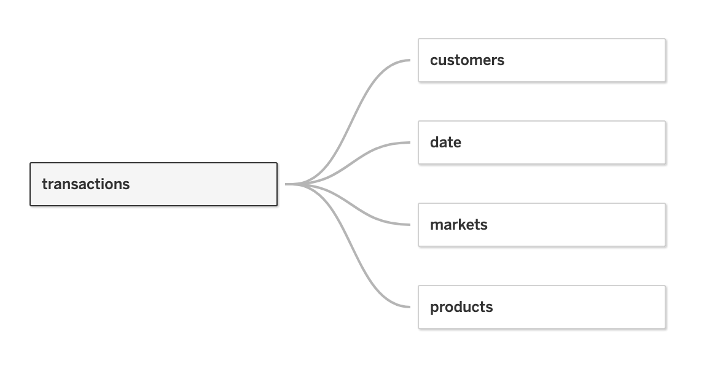

# Sales insights of AtliQ Hardware

##To unlock sales insights that are not visible before for sales team for decision support and automate them to reduced manual time spent in data gathering.

## AtliQ Hardware
A company that supplies computer hardware and peripherals to many clients across India.\
The company has a head office in Delhi and regional offices throughout India.

---

## Business Issue
The sales director is facing a lot of challenges. The marketing is growing dynamically, he is struggling to keep track of the sales. He needs more accurate insights about the company sales and then makes the necessary decisions.

---

## Solution
- Create a simple and informative dashboard about the company sales.
- I used **`SQL`** queries in **`MySQL Workbench`** to look into the data and **`Tableau`** for **`ETL`** and **`Visualizations`** to create the insights dashboard.

---

## Data Overview

#### `# Tables`
    
<table>
<tr><th>1. transactions</th><th>2. customers</th><th>3. date</th><th> 4. products </th><th> 5. markets </th></tr>
<tr><td>

|Field Name|Description|
|----|---|
|Product Code|ProdXXX|
|Customer Code|CusXXX|
|Market Code|MarkXXX|
|Order Date|YYYY-MM-DD|
|Sales Qty|Quantity Sold|
|Sales Amount|Sales Amount|
|Currency|INR/USD|
|Profit Margin|(Sales Amount - Cost)/(Sales Amount)|
|Profit|(Sales Amount-Cost)|
|Cost|Total Cost of a Product|

</td><td>

|Field Name|Description|
|---|---|
|Customer Code|CusXXX|
|Custmer Name|Stores Names|
|Customer Type|Brick & Mortar/ E-Commerce|

</td><td>

|Field Name|Description|
|---|---|
|Date|YYYY-MM-DD|
|Cy Date|YYYY-MM-DD: Starting date of each month of date|
|Year|YYYY: Year of the date|
|Month Name|MMMM: Month of the date column|
|Date Yy Mmm|DD-MMM: Date and Month of the date column|
	
</td><td>
	
|Field Name|Description|
|---|---|
|Product Code|ProdXXX|
|Product Type|Own Brand/Distribution|

</td><td>

|Field Name|Description|
|---|---|
|Markets Code|MarkXXX|
|Markets Name|City Names|
|Zone|South/Central/North|


</td></tr> </table>

#  
#### `# Data Analysis Using SQL`

1. Show all tables and their rows in sales schema
    	 
	 > ```
	 > SELECT TABLE_SCHEMA, TABLE_NAME, TABLE_ROWS  
	 > FROM INFORMATION_SCHEMA.TABLES 
	 > WHERE TABLE_SCHEMA = 'sales';
	 > ```
	 > |TABLE_SCHEMA|TABLE_NAME|TABLE_ROWS|
	 > |---|----|---|
	 > |sales|customers|38|
	 > |sales|date|1126|
	 > |sales|markets|17|
	 > |sales|products|279|
	 > |sales|ransactions|147678|


1. Show date range
    	
	> ```
	> SELECT 'First Date', MIn(Order_Date)  
	> FROM sales.transactions  
	> UNION  
	> SELECT 'Last Date', MAX(Order_Date)  
	> FROM sales.transactions;
	> ``` 
	> 
	> <table>
	> <tr>
	>     <td>First Date</td>
	>     <td>2017-10-04</td>
	> </tr>
	> <tr>
	>     <td>Last Date</td>
	>     <td>2020-06-26</td>
	> </tr>
	> </table>


1. Show Revenue in 2020 and 2019.

	> ```
	> SELECT d.year, SUM(Sales_Amount)
	> FROM sales.transactions as t
	> JOIN sales.date as d
	> ON t.Order_Date = d.date
	> WHERE d.year = '2019'
	> UNION
	> SELECT d.year, SUM(Sales_Amount)
	> FROM sales.transactions as t
	> JOIN sales.date as d
	> ON t.Order_Date = d.date
	> WHERE d.year = '2020';
	> ``` 
	> 
	> <table>
	> <tr>
	>     <td>2019</td>
	>     <td>336019102</td>
	> </tr>
	> <tr>
	>     <td>2020</td>
	>     <td>142224545</td>
	> </tr>
	> </table>


1. Show distinct currency and their count

	> ```
	> SELECT currency, COUNT(currency)
	> FROM sales.transactions
	> GROUP BY currency;
	> ``` 
	> 
	> <table>
	> <tr>
	>     <td>INR</td>
	>     <td>148393</td>
	> </tr>
	> <tr>
	>     <td>USD</td>
	>     <td>2</td>
	> </tr>
	> </table>

	
# 
#### `# Insights`
After a quick data exploration in MySQL, here are some initial findings:
- The database contains 5 tables: customers, date, markets, products, and transactions.
- There are 17 markets, 279 products, and 38 customers.
- The observation period is from OCT 2017 to JUN 2020.
- The total revenue in 2020 was ₹ 142.22 M, 57.7% less than 2019, which was ₹ 336.02 M.
- Most of the transactions data are in INR(₹) currency, but we have 2 records in US($) currency. 
- And we got some garbage values in sales amount and market column. We’re going to deal with it in the ETL process.

---

## ETL(Extract, Transform, Load)
Once I knew the basic features of the data I had to work with, I Imported the MySQL database into Tableau to do the necessary transformations and make a simple, reliable, and helpful dashboard.

# 

#### # Data Modeling Step
We have one main table and four other tables having one shared column with the main table. So we will connect the other tables to the main table using the shared columns.


- Main Table: transactions

|Table|Column|Main Table Column|   
|---|---|---|
|customers|Customer_Code|Customer_Code|
|date|date|Order_Date|
|products|Market_Code|Market_Code|
|markets|Product_Code|Product_Code|


# 

#### # Filtering, Cleaning and Adding New Columns
- The company is serving only in India, So “Paris” and “New York” in the market table are garbage values, so filtering them out.
- The “currency” column (in transactions table) have 2 USD currency values, So created a new column called “Sales”, where all the sales_amount is in INR Currency.

---

## Dashboards
The two dashboards shows all the main information about the company sales.

#### # Dashboard 1: Sales Insights
<div class='tableauPlaceholder' id='viz1676477772813' style='position: relative'><noscript><a href='#'></a></noscript><object class='tableauViz'  style='display:none;'><param name='host_url' value='https%3A%2F%2Fpublic.tableau.com%2F' /> <param name='embed_code_version' value='3' /> <param name='site_root' value='' /><param name='name' value='AtliQHardwareSalesInsights&#47;AtliqHardware' /><param name='tabs' value='yes' /><param name='toolbar' value='yes' /><param name='static_image' value='https:&#47;&#47;public.tableau.com&#47;static&#47;images&#47;At&#47;AtliQHardwareSalesInsights&#47;AtliqHardware&#47;1.png' /> <param name='animate_transition' value='yes' /><param name='display_static_image' value='yes' /><param name='display_spinner' value='yes' /><param name='display_overlay' value='yes' /><param name='display_count' value='yes' /><param name='language' value='en-US' /></object></div>                

    - Revenue
    - Net Profit
    - Revenue by Market
    - Profit Trend by Market
    - Revenue by Top 10 Products
    - Profit Trend by Top 10 Products

#### # Dashboard 2: Loss Analaysis
<div class='tableauPlaceholder' id='viz1676478014567' style='position: relative'><noscript><a href='#'></a></noscript><object class='tableauViz'  style='display:none;'><param name='host_url' value='https%3A%2F%2Fpublic.tableau.com%2F' /> <param name='embed_code_version' value='3' /> <param name='site_root' value='' /><param name='name' value='AtliQHardwareSalesInsights&#47;LossAnalysis' /><param name='tabs' value='yes' /><param name='toolbar' value='yes' /><param name='static_image' value='https:&#47;&#47;public.tableau.com&#47;static&#47;images&#47;At&#47;AtliQHardwareSalesInsights&#47;LossAnalysis&#47;1.png' /> <param name='animate_transition' value='yes' /><param name='display_static_image' value='yes' /><param name='display_spinner' value='yes' /><param name='display_overlay' value='yes' /><param name='display_count' value='yes' /><param name='language' value='en-US' /></object></div>                

    - Loss Amount
    - Markets Which creating Loss
    - Top 10 Lossing Products

- It can be filtered by YEAR and it's a interactive Dashboard i.e, each other insights are inter-related and can be seen in any respects. So the sales director can have a deeper and quick view of the sales to support his decision making process.

---
## Final Report
Based on the dashbaords insights, I have made some conclusionsthat Sales Marketing team should/can consider making a sales strategy.

#### # Conclusions
- Sales were rapidly decreasing in 2020 compared to 2019 by around 57.7%.
- Highest revenue generated from Markets such as Delhi NCR, Mumbai, Ahmedabad, Bhopal, Nagpur, and so on.
- Highest quantities sold in the Market such as Delhi NCR, Mumbai, Nagpur, Kochi, Ahmedabad, and so on.
- Majority of the sales were takes place in the month of January followed by November and March.


